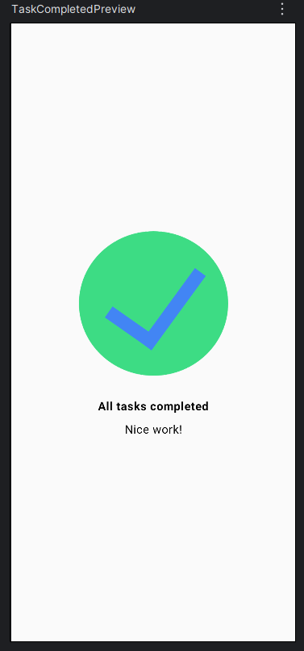
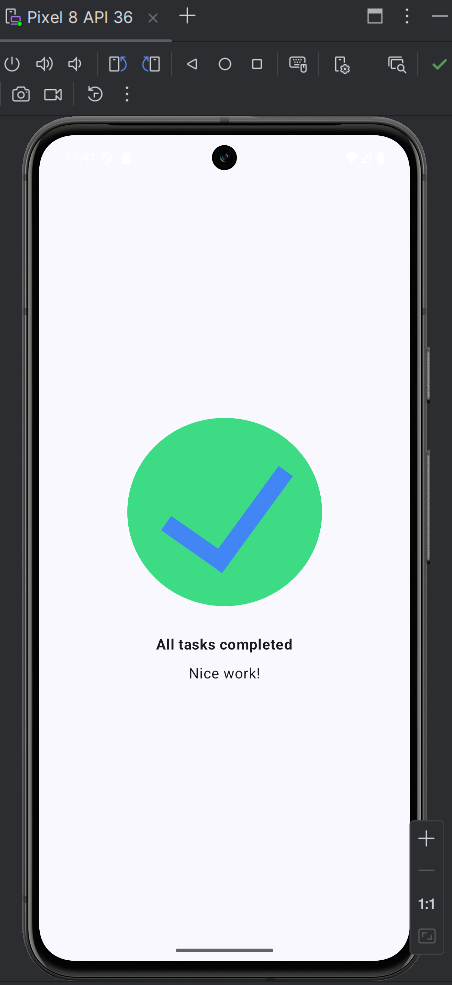

# TaskCompletedApp-Compose

An Android application built with Jetpack Compose that presents a simple “task completed” screen. The project focuses on layout alignment, composable functions, and clean UI structuring using modern Android development practices.

---

## Overview

This application displays a centered confirmation interface indicating that all tasks have been completed. It is designed to demonstrate how to structure UI components using Jetpack Compose.

The interface includes:

* A completion icon
* A bold confirmation message
* A supporting text message

---

## Screenshots

### Interface Design



### Running Application



---

## Technologies Used

* Kotlin
* Jetpack Compose
* Android Studio
* Material3

---

## Features

* Centered layout using `Column`
* Vertical and horizontal alignment using Compose arrangements
* Image rendering using `Image` composable
* Text styling with `FontWeight.Bold`
* Spacing and layout control using `Modifier.padding`

---

## Implementation Details

The UI is built using a single composable function that organizes elements vertically and aligns them at the center of the screen.

* `Column` is used as the main layout container
* `Arrangement.Center` ensures vertical centering
* `Alignment.CenterHorizontally` ensures horizontal centering
* Resources are loaded using `painterResource` and `stringResource`

---

## Project Structure

```id="5ps3hj"
app/
 ├── java/com/example/question2/
 │    ├── MainActivity.kt
 │    └── TaskCompletedScreen.kt
 │
 ├── res/
 │    ├── drawable/
 │    │    └── ic_task_completed.png
 │
 │    ├── values/
 │    │    └── strings.xml
```

---

## How to Run

1. Clone the repository:

```
git clone https://github.com/LungeloMK/TaskCompletedApp-Compose.git
```

2. Open the project in Android Studio

3. Run the application on an emulator or physical Android device

---

## Notes

* This project demonstrates layout alignment and UI composition using Jetpack Compose
* Developed as part of a practical exercise focusing on modern Android UI techniques

---

## Author

Lungelo
